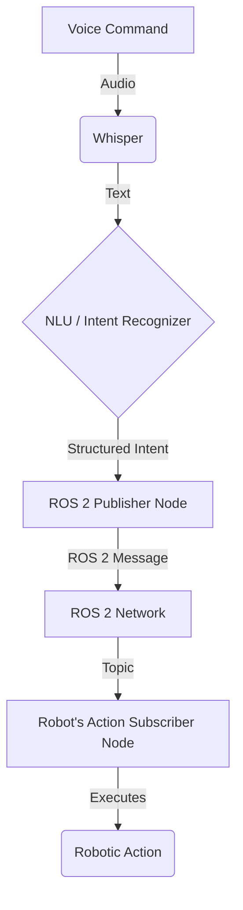

This chapter explores the fundamental concepts behind converting a spoken command into a robotic action. This voice-to-action pipeline is a cornerstone of modern human-robot interaction, enabling intuitive control of complex systems.

## The Whisper-to-ROS 2 Pipeline

The process can be broken down into four main stages:

1.  **Audio Capture**: A microphone captures the user's voice command as raw audio data.
2.  **Transcription**: The audio data is fed into a speech-to-text engine, such as OpenAI's Whisper, which transcribes the audio into a text string.
3.  **Intent Recognition**: The transcribed text is processed by a Natural Language Understanding (NLU) model. This model interprets the user's goal and converts it into a structured format known as an "intent." This intent typically includes the desired action and any relevant parameters (e.g., target object, direction, speed).
4.  **Action Execution**: The structured intent is published as a message to a specific topic in the ROS 2 network. A ROS 2 node subscribed to that topic receives the message and executes the corresponding robotic action.

### Data Flow Diagram

Here is a simplified diagram illustrating the flow of data from voice to action:

### Example 1: Simple Navigation

-   **Voice Command**: "Robot, move forward."
-   **Whisper Output**: `"Robot, move forward."`
-   **Intent Recognizer Output**: `{ "action": "move", "direction": "forward", "speed": "normal" }`
-   **ROS 2 Action Breakdown**:
    -   A `Twist` message is published to the `/cmd_vel` topic.
    -   The `linear.x` component of the message is set to a positive value (e.g., `0.5`).
    -   The `angular.z` component is set to `0`.

### Example 2: Object Interaction

-   **Voice Command**: "Pick up the red ball."
-   **Whisper Output**: `"Pick up the red ball."`
-   **Intent Recognizer Output**: `{ "action": "pick_up", "object": "ball", "color": "red" }`
-   **ROS 2 Action Breakdown**:
    1.  A perception node is triggered to locate an object matching the description "red ball".
    2.  Once the object's coordinates are identified, a motion planning service (like MoveIt 2) is called to generate a trajectory for the robot's arm.
    3.  The arm's joint controllers execute the trajectory.
    4.  The gripper is actuated to close on the ball.