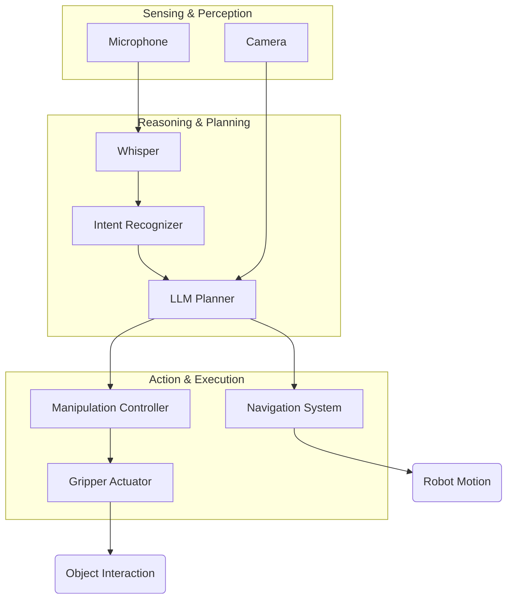

This chapter provides a high-level overview of how the concepts from the previous chapters—voice-to-action and cognitive planning—come together in a complete, autonomous humanoid robotics workflow. This is the "capstone" view that illustrates the full end-to-end system.

## The Full VLA Workflow

The Vision-Language-Action (VLA) model integrates perception (vision), reasoning (language), and execution (action) into a cohesive system. A humanoid robot equipped with a VLA system can interact with its environment in a remarkably sophisticated and human-like way.

The workflow can be summarized as follows:

1.  **Sensing**: The robot uses its sensors (cameras, microphones, etc.) to perceive the world around it.
2.  **User Command**: The user issues a high-level voice command (e.g., "Tidy up the living room").
3.  **Transcription & Intent**: The command is transcribed (Whisper) and converted into a structured intent.
4.  **Cognitive Planning**: The high-level intent is sent to an LLM, which acts as the cognitive planner. The LLM breaks the task down into a sequence of logical steps, taking into account the robot's capabilities and the state of the environment.
5.  **Execution**: The robot's control system executes the action sequence. Each step may involve complex sub-actions like navigation, object detection, and manipulation.
6.  **Feedback Loop**: Throughout the process, the robot continuously uses its sensors to monitor its progress and adjust its actions as needed. This feedback loop is crucial for handling unexpected events and ensuring the task is completed successfully.

### System Architecture Diagram

This diagram illustrates the flow of information and control in a complete VLA system.

This integrated system allows a robot to move beyond simple, pre-programmed tasks and begin to understand and respond to the world in a much more flexible and intelligent way.